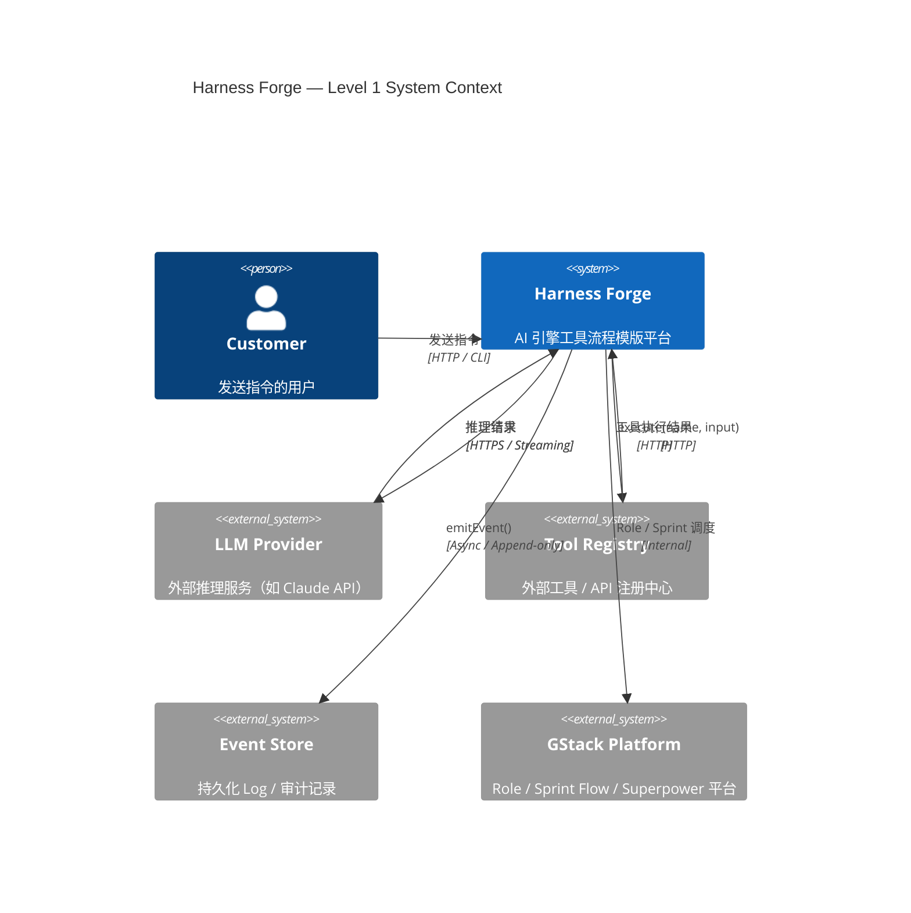
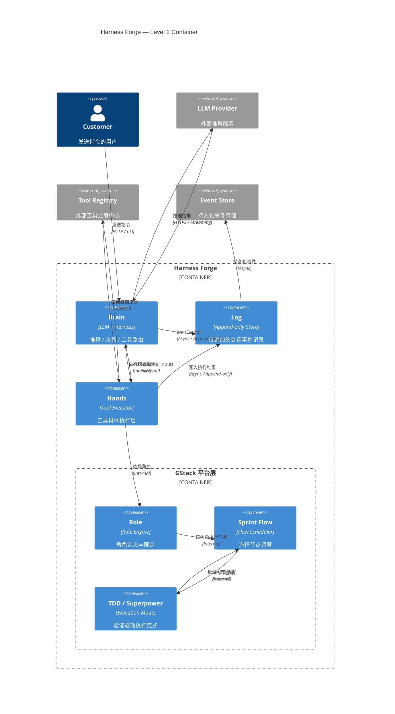
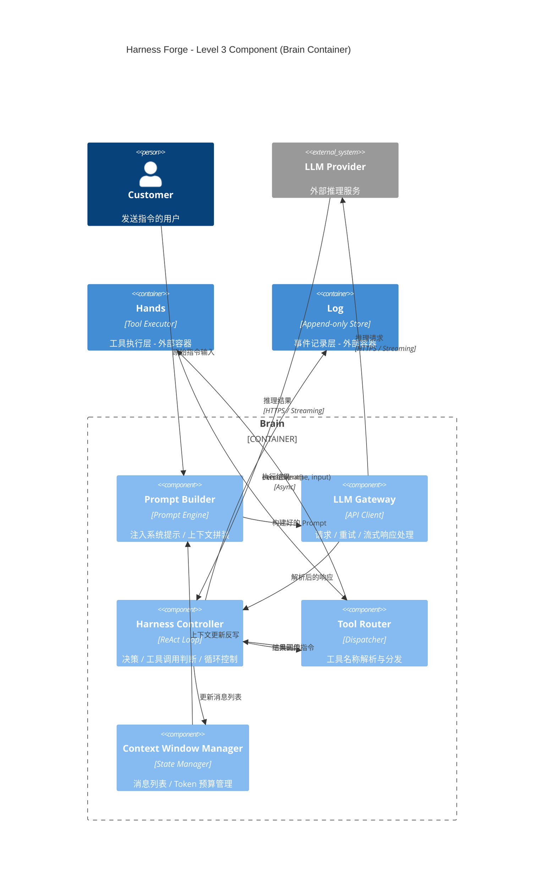

# System Architecture (C4)

### Level 1 — System Context

```mermaid
C4Context
    title Harness Forge — Level 1 System Context

    Person(Customer, "Customer", "发送指令的用户")
    System(HarnessForge, "Harness Forge", "AI 引擎工具流程模版平台")
    System_Ext(LLMProvider, "LLM Provider", "外部推理服务（如 Claude API）")
    System_Ext(ToolRegistry, "Tool Registry", "外部工具 / API 注册中心")
    System_Ext(EventStore, "Event Store", "持久化 Log / 审计记录")
    System_Ext(GStackPlatform, "GStack Platform", "Role / Sprint Flow / Superpower 平台")

    Rel(Customer, HarnessForge, "发送指令", "HTTP / CLI")
    Rel(HarnessForge, LLMProvider, "推理请求", "HTTPS / Streaming")
    Rel(LLMProvider, HarnessForge, "推理结果", "HTTPS / Streaming")
    Rel(HarnessForge, ToolRegistry, "execute(name, input)", "HTTP")
    Rel(ToolRegistry, HarnessForge, "工具执行结果", "HTTP")
    Rel(HarnessForge, EventStore, "emitEvent()", "Async / Append-only")
    Rel(HarnessForge, GStackPlatform, "Role / Sprint 调度", "Internal")
```

### Level 2 — Container

```mermaid
C4Container
    title Harness Forge — Level 2 Container

    Person(Customer, "Customer", "发送指令的用户")
    System_Ext(LLMProvider, "LLM Provider", "外部推理服务")
    System_Ext(ToolRegistry, "Tool Registry", "外部工具注册中心")
    System_Ext(EventStore, "Event Store", "持久化事件存储")

    Container_Boundary(hf, "Harness Forge") {
        Container(Brain, "Brain", "LLM + Harness", "推理 / 决策 / 工具路由")
        Container(Log, "Log", "Append-only Store", "仅追加的会话事件记录")
        Container(Hands, "Hands", "Tool Executor", "工具具体执行层")

        Container_Boundary(gstack, "GStack 平台层") {
            Container(Role, "Role", "Role Engine", "角色定义与限定")
            Container(SprintFlow, "Sprint Flow", "Flow Scheduler", "流程节点调度")
            Container(TDD, "TDD / Superpower", "Execution Mode", "验证驱动执行范式")
        }
    }

    Rel(Customer, Brain, "发送指令", "HTTP / CLI")
    Rel(Brain, LLMProvider, "推理请求", "HTTPS / Streaming")
    Rel(LLMProvider, Brain, "推理结果", "HTTPS / Streaming")
    Rel(Brain, Hands, "execute(name, input)", "Internal")
    Rel(Hands, Brain, "执行结果返回", "Internal")
    Rel(Brain, Log, "emitEvent()", "Async / Append-only")
    Rel(Hands, Log, "写入执行结果", "Async / Append-only")
    Rel(Hands, ToolRegistry, "调用外部工具", "HTTP")
    Rel(ToolRegistry, Hands, "工具结果", "HTTP")
    Rel(Log, EventStore, "持久化事件", "Async")
    Rel(Hands, Role, "选择角色", "Internal")
    Rel(Role, SprintFlow, "按角色执行任务", "Internal")
    Rel(SprintFlow, TDD, "TDD 模式执行", "Internal")
    Rel(TDD, SprintFlow, "验证结果反馈", "Internal")
```

### Level 3 — Component (Brain)

```mermaid
C4Component
    title Harness Forge - Level 3 Component (Brain Container)

    Person(Customer, "Customer", "发送指令的用户")
    System_Ext(LLMProvider, "LLM Provider", "外部推理服务")
    Container(Hands, "Hands", "Tool Executor", "工具执行层 - 外部容器")
    Container(Log, "Log", "Append-only Store", "事件记录层 - 外部容器")

    Container_Boundary(brain, "Brain") {
        Component(PromptBuilder, "Prompt Builder", "Prompt Engine", "注入系统提示 / 上下文拼装")
        Component(LLMGateway, "LLM Gateway", "API Client", "请求 / 重试 / 流式响应处理")
        Component(HarnessController, "Harness Controller", "ReAct Loop", "决策 / 工具调用判断 / 循环控制")
        Component(ToolRouter, "Tool Router", "Dispatcher", "工具名称解析与分发")
        Component(ContextWindowManager, "Context Window Manager", "State Manager", "消息列表 / Token 预算管理")
    }

    Rel(Customer, PromptBuilder, "原始指令输入")
    Rel(PromptBuilder, LLMGateway, "构建好的 Prompt")
    Rel(LLMGateway, LLMProvider, "推理请求", "HTTPS / Streaming")
    Rel(LLMProvider, HarnessController, "推理结果", "HTTPS / Streaming")
    Rel(LLMGateway, HarnessController, "解析后的响应")
    Rel(HarnessController, ToolRouter, "工具调用指令")
    Rel(HarnessController, ContextWindowManager, "更新消息列表")
    Rel(ToolRouter, Hands, "execute(name, input)")
    Rel(Hands, ToolRouter, "执行结果")
    Rel(ToolRouter, HarnessController, "结果回传")
    Rel(ContextWindowManager, PromptBuilder, "上下文更新反写")
    Rel(HarnessController, Log, "emitEvent()", "Async")
```
